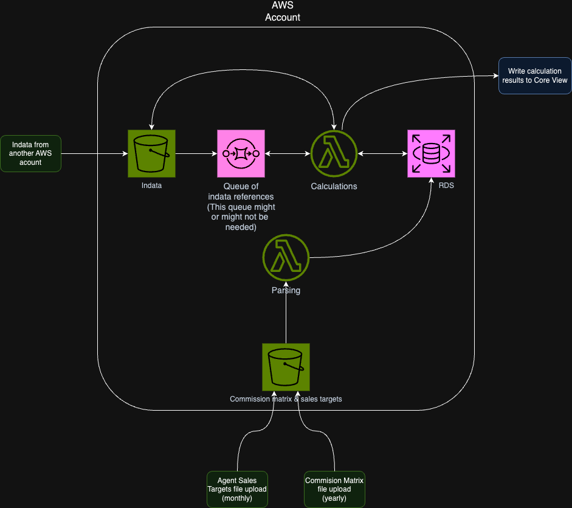

# bwm-planning

## Overview infrastructure

## Time estimation

### 1. Requirement Gathering and Analysis

- **Duration:** 1-2 weeks
- **Activities:**
  - Define and document the project scope.
  - Identify all the AWS components and external integrations (E.g. Core View).
  - Understand the data formats, security requirements, and compliance needs.
- **Output:** A detailed requirement document.

### 2. Architecture Design

- **Duration:** 1-3 weeks
- **Activities:**
  - Design the detailed architecture.
  - Identify necessary AWS services and how they will interact.
  - Plan for scalability, security, and compliance.
- **Output:** Architecture diagrams and service selection.

### 3. CI/CD Planning and Design

- **Duration:** Concurrent with Architecture Design - 1-2 weeks
- **Activities:** Decide on CI/CD tools (e.g., AWS CodePipeline), define stages of the pipeline.

### 4. Project Planning

- **Duration:** 1 week
- **Activities:**
  - Break down the project into smaller tasks or sprints.
  - Estimate time for each task based on complexity.
  - Allocate resources and set deadlines.
- **Output:** Project plan and timeline.

### 5. Development and Configuration

- **Duration:** Variable (3-6 months)
- **Factors Affecting Duration:**
  - Complexity of the calculations and data processing logic.
  - Integration complexity with Core View and other systems.
  - Custom development vs. using out-of-the-box AWS solutions.
- **Activities:**
  - Setup AWS environment (VPC, IAM roles, etc.).
  - Develop Lambda functions, data processing scripts, and integration points.
  - Configure databases, S3 buckets, and other AWS services.
- **Output:** Working AWS infrastructure.

### 6. CI/CD Implementation

- **Duration:** Concurrent with Development and Configuration - Adds an additional 1-2 months
- **Activities:** Set up source control, build CI pipelines, create CD pipelines, integrate with the AWS environment.

### 7. Testing

- **Duration:** 3-5 weeks
- **Activities:**
  - Some of these tasks will be done concurrently with development (e.g. unit tests).
  - Perform unit testing, integration testing, and system testing.
  - Test data processing logic, AWS service configurations, and Core View integration.
  - Perform load testing to ensure scalability.
- **Output:** Test reports and a stable system.

### 8. CI/CD Testing and Optimization

   - **Duration:** Concurrent with Testing phase - Adds 1 week
   - **Activities:** Test CI/CD pipeline, optimize for performance and reliability.

### 9. Deployment

- **Duration:** 1-2 weeks
- **Activities:**
  - Deploy the solution to the production environment.
  - Perform final checks and validations.
- **Output:** Live system in production.

### 10. Post-Deployment Monitoring and Optimization

- **Duration:** Ongoing
- **Activities:**
  - Monitor system performance and stability.
  - Optimize configurations for cost, performance, and security.
- **Output:** Optimized and stable production system.

### 11. Documentation and Training

- **Duration:** 1-2 weeks
- **Activities:**
  - Document the system architecture, configurations, and operational procedures.
  - Train the team on system management and best practices.
- **Output:** Comprehensive documentation and a trained team.

### Additional Considerations

- **Buffer Time:** Include buffer time (10-20% of the total estimated time) for unforeseen delays.
- **Stakeholder Reviews:** Schedule regular check-ins with stakeholders to ensure alignment.
- **Agile Methodology:** If using Agile, plan in sprints, and reassess after each sprint.

### Final Note

The actual duration will depend on the complexity of your specific requirements, the size of your team, their skill levels, and external dependencies. Regularly review the project progress against the plan and adjust timelines as necessary.

Incorporating CI/CD into your AWS infrastructure project planning, you can allocate additional time for setting up and integrating the CI/CD pipeline as follows:

1. **CI/CD Planning and Design**
   - **Duration:** Concurrent with Architecture Design - 1-2 weeks
   - **Activities:** Decide on CI/CD tools (e.g., AWS CodePipeline), define stages of the pipeline.

2. **CI/CD Implementation**
   - **Duration:** Concurrent with Development and Configuration - Adds an additional 1-2 months
   - **Activities:** Set up source control, build CI pipelines, create CD pipelines, integrate with the AWS environment.

3. **CI/CD Testing and Optimization**
   - **Duration:** Concurrent with Testing phase - Adds 1 week
   - **Activities:** Test CI/CD pipeline, optimize for performance and reliability.

By integrating CI/CD into the initial timeline, the total duration of the project might increase slightly, but it also ensures a more robust, efficient, and automated deployment process.