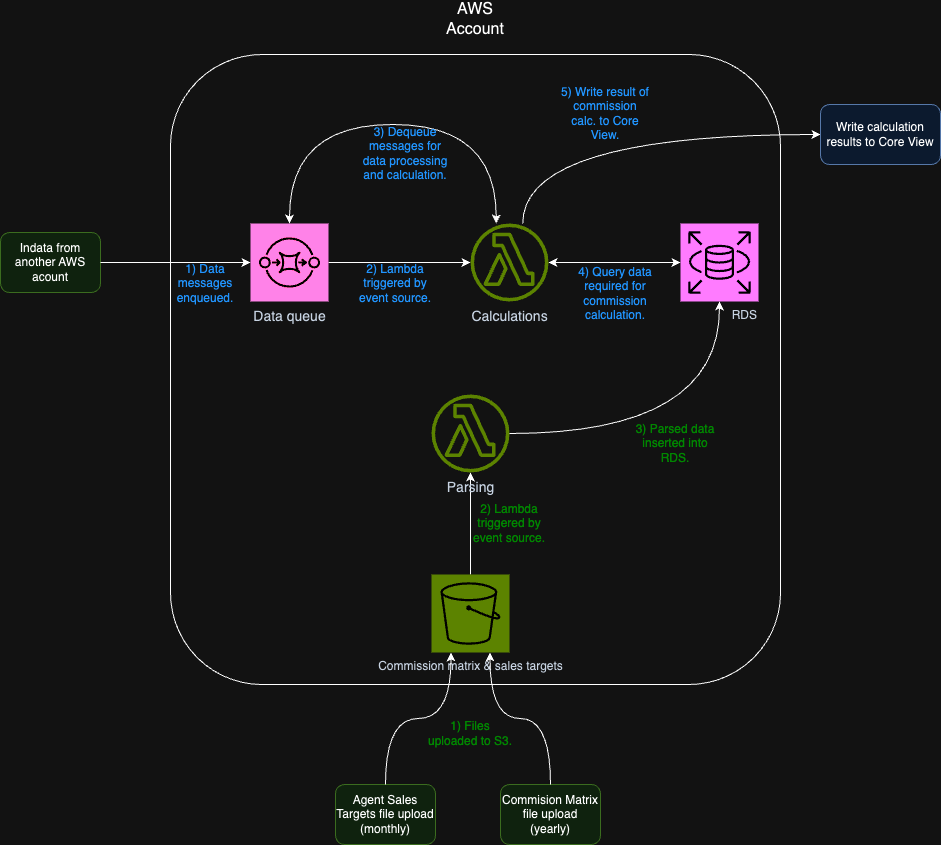

# bwm-planning

## Overview infrastructure

## Time estimation

### 1. Requirement Gathering and Analysis

- **Duration:** 1-2 weeks
- **Activities:**
  - Define and document the project scope.
  - Does BMW have requirement for certain tools (e.g. programming language, CI/CD, CDK vs cloudformation)?
  - Understand the data formats, security requirements, and compliance needs.
  - Identify structure of incomming data from external AWS account.
  - Identify the structure and size of the data in the files to be uploaded.
  - Understand the scalability/throughput needs of the product.
  - Indentify AWS components and external integrations.
  - Core View does not seem to have its own API. Investigate how to interact with Core View.
- **Output:** A detailed requirement document.

### 2. Architecture Design

- **Duration:** 2-3 weeks
- **Activities:**
  - Detailed architecture.
  - Database design.
  - Flowchart for calculations lambda.
  - Flowchart for parsing lambda.
  - Identify necessary AWS services, how they interact and pick the optimal composition depending on the requirements.
  - Plan for scalability, security, and compliance.
- **Output:** Architecture diagrams and service selection.

### 3. CI/CD Planning and Design

- **Duration:** Concurrent with Architecture Design - 1 week
- **Activities:**
  - Decide on CI/CD tools (preferably github actions).
  - Repository structure and settings.
  - Pick branching strategy.
  - Secret management.
  - Repository access control.
  - Plan automated testing.
  - Building and deployment.
- **Output:** Document for CI/CD design, configured repository.

### 4. Project Planning

- **Duration:** 3 days
- **Activities:**
  - Break down the project into smaller tasks or sprints.
  - Estimate time for each task based on complexity.
  - Allocate resources and set deadlines.
- **Output:** Project plan and timeline.

### 5. Development and Configuration

- **Duration:** Variable (2-3 months)
- **Factors Affecting Duration:**
  - Complexity of the calculations and data processing logic.
  - Integration complexity with Core View and other systems.
  - Responsiveness and burocracy of BMW.
  - Tool requirements of BMW (programming language, CI/CD tools etc.)
- **Activities:**
  - Setup AWS account for dev.
  - Configure AWS infrastructure either with cloudformation or CDK:
    - SQS.
    - S3 bucket.
    - Calculation lambda.
    - Parsing lambda.
    - RDS.
    - IAM roles.
    - VPC.
  - Develop parsing lambda.
  - Develop calculation lambda.
  - Write SQL for database schemas.
  - Integrate towards Core View.
- **Output:** Working AWS infrastructure.

### 6. CI/CD Implementation

- **Duration:** Concurrent with Development and Configuration - Adds an additional 2 weeks.
- **Activities:** 
  - Set up source control.
  - Build CI pipelines.
  - Create CD pipelines.
- **Output:** Fully working CI/CD pipelines.

### 7. Testing

- **Duration:** Concurrent with Development and Development - Adds and additonal 2-4 weeks.
- **Activities:**
  - Perform unit testing.
  - Test data processing logic.
  - Test AWS service configurations.
  - Test Core View integration.
  - Test end to end flow.
- **Output:** High test coverage and tested system.

### 8. Deployment

- **Duration:** 1 week
- **Activities:**
  - Deploy the solution to the production environment.
  - Perform final checks and validations.
- **Output:** Live system in production.

### 9. Post-Deployment Monitoring and Optimization

- **Duration:** Ongoing
- **Activities:**
  - Monitor system performance and stability.
  - Optimize configurations for cost, performance, and security.
- **Output:** Optimized and stable production system.